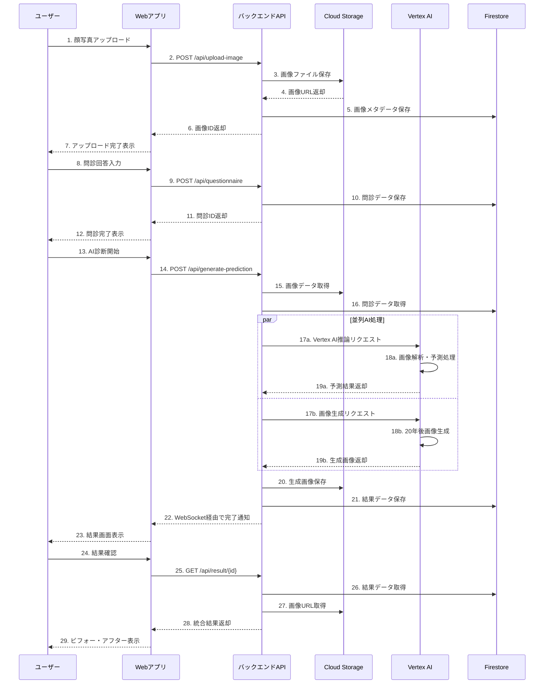

# 要件定義書

## はじめに

この要件定義書は、システム概要に記載された利用者体験を実現するために必要な機能要件およびインフラ要件を明確にすることを目的としています。本書では、非機能要件を省略し、システムがどのような環境でどのような機能を提供するかに焦点を当てています。

## 機能要件

### FR-001. 顔写真アップロード機能

**概要**:
利用者が自身の顔写真をシステムにアップロードできる機能を提供します。

**入出力データ形式**:

- 入力：JPEG、PNG 形式の画像ファイル（最大 10MB）
- 出力：アップロード成功/失敗のレスポンス、画像 ID

**UI/UX 要件**:

- ドラッグ&ドロップによるファイル選択
- プレビュー表示機能
- アップロード進捗表示

**API 仕様**:

- エンドポイント：`POST /api/upload-image`
- リクエスト形式：multipart/form-data
- レスポンス形式：JSON

**エラーハンドリング**:

- ファイル形式不正、サイズ超過、顔認識失敗時の適切なエラーメッセージ表示

### FR-002. 問診回答機能

**概要**:
利用者が喫煙習慣や健康状態に関する問診に回答できるインターフェースを提供します。

**入出力データ形式**:

- 入力：問診項目への回答（選択式、数値入力）
- 出力：問診結果データ（JSON 形式）

**UI/UX 要件**:

- ステップ式の問診フォーム
- 進捗インジケーター
- 入力値検証とリアルタイムフィードバック
- レスポンシブデザイン対応

**API 仕様**:

- エンドポイント：`POST /api/questionnaire`
- リクエスト形式：JSON
- レスポンス形式：JSON

**エラーハンドリング**:

- 必須項目未入力、数値範囲外、通信エラー時の処理

### FR-003. AI 診断および画像生成機能

**概要**:
アップロードされた顔写真と問診結果を基に、20 年後の肌状態や身体的変化を予測し、画像を生成する機能を提供します。

**入出力データ形式**:

- 入力：画像 ID、問診結果データ
- 出力：予測結果データ、生成画像 URL

**API 仕様**:

- エンドポイント：`POST /api/generate-prediction`
- 処理時間：30-60 秒（非同期処理）
- WebSocket 接続による進捗通知

**エラーハンドリング**:

- AI 処理失敗、画像生成エラー、タイムアウト処理

### FR-004. 結果提示機能

**概要**:
診断結果と生成された画像を利用者に提示する機能を提供します。

**入出力データ形式**:

- 入力：予測結果 ID
- 出力：統合された診断結果（画像、テキスト）

**UI/UX 要件**:

- ビフォー・アフター画像の比較表示
<!-- - 健康リスク指標のビジュアル化 -->
- 結果の PDF 出力機能
- SNS 共有機能（匿名化オプション）

**API 仕様**:

- エンドポイント：`GET /api/result/{id}`
- レスポンス形式：JSON

**エラーハンドリング**:

- 結果未完成、データ不整合時の処理

## インフラ要件

### 推奨技術スタック（GCP 中心）

**フロントエンド**:

- React.js 18+ with TypeScript
- Material-UI
- ホスティング：Firebase Hosting

**バックエンド**:

- **推奨**: Python 3.9+ with FastAPI
  - Google ADK (Application Development Kit) との高い親和性
  - Vertex AI Python SDK の豊富な機能とドキュメント
  - GCP の AI/ML サービス群との最適化された連携
- 代替案: Node.js 18+ with Express.js + TypeScript
- デプロイ：Cloud Run（コンテナ化）
- 認証：Firebase Authentication

**データベース**:

- Firestore（NoSQL、リアルタイム更新）
- Cloud Storage（画像ファイル保存）
- Redis（キャッシュ）

**AI/ML**:

- Vertex AI（画像解析、予測モデル）
- Cloud Vision API（顔認識）
- Custom ML models（健康影響予測）

**その他 GCP サービス**:

- Cloud Load Balancing（負荷分散）
- Cloud CDN（静的コンテンツ配信）
- Cloud Monitoring（監視）
- Cloud Logging（ログ管理）
- Cloud IAM（アクセス制御）

### インフラ要件詳細

1. **クラウド環境の利用**:
   Google Cloud Platform（GCP）を基盤とし、スケーラブルで信頼性の高いインフラを構築します。

2. **データセキュリティ**:

   - データ暗号化（保存時・転送時）
   - VPC ネットワークによる通信制御
   - IAM による最小権限アクセス
   - 画像データの自動削除（処理完了後 24 時間）

3. **高可用性**:

   - マルチリージョン構成（asia-northeast1, asia-northeast2）
   - Cloud Run 自動スケーリング
   - Firestore 自動レプリケーション
   - 99.9%以上の稼働率保証

4. **拡張性**:
   - サーバーレスアーキテクチャ採用
   - マイクロサービス設計
   - API Gateway 経由のトラフィック制御
   - 水平スケーリング対応

## 運用・保守要件

### 監視

**システム監視**:

- Cloud Monitoring によるリアルタイム監視
- アプリケーションレベル、インフラレベルの両方を監視
- SLI/SLO の設定（可用性 99.9%、レスポンス時間 3 秒以内）

**アラート設定**:

- エラー率閾値超過時の自動通知
- リソース使用率監視
- 異常なトラフィックパターンの検知
- Slack/メール通知連携

**ログ管理**:

- Cloud Logging による集約管理
- アプリケーションログ、アクセスログ、エラーログの分類
- ログ保持期間：30 日

### バックアップ

**データバックアップ**:

- Firestore 自動バックアップ（日次）
- Cloud Storage 定期バックアップ（週次）
- バックアップ保持期間：30 日
- 災害時復旧手順の文書化

**設定バックアップ**:

- Infrastructure as Code（Terraform）による設定管理
- Git による設定ファイルのバージョン管理
- 環境復旧の自動化

### デプロイメント戦略

**CI/CD パイプライン**:

- GitHub Actions による自動化
- 開発（dev）→ ステージング（staging）→ 本番（prod）の 3 段階デプロイ
- 自動テスト（ユニット、統合、E2E）の実行

**デプロイメント手法**:

- Blue-Green Deployment
- Cloud Run Traffic Splitting による段階的ロールアウト
- 自動ロールバック機能

**品質管理**:

- Code review 必須
- SonarQube による静的解析
- セキュリティスキャン（SAST/DAST）
- パフォーマンステスト

### セキュリティ

**定期的セキュリティ対策**:

- 依存関係の脆弱性スキャン
- SSL/TLS 証明書の自動更新
- Security Command Center による脅威検知
- 定期的なペネトレーションテスト

**コンプライアンス**:

- 個人情報保護法対応
- データ保持期間の適切な管理
- 監査ログの取得・保管

## システムフロー

### 正常系データシーケンス図

## おわりに

本要件定義書に記載された内容は、システム開発の指針となるものです。開発プロセスにおいて新たな要件が発生した場合は、適宜本書を更新し、関係者間で共有することを推奨します。
