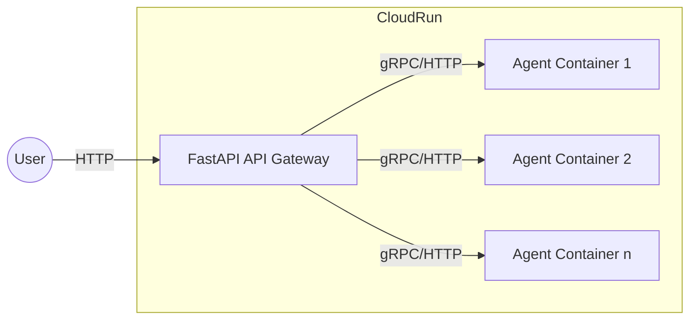
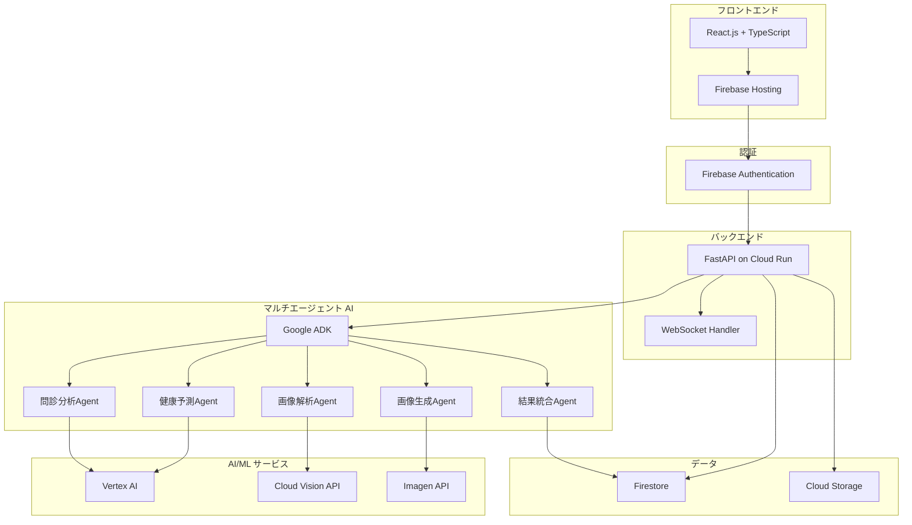

# システムアーキテクチャ（ハッカソン最小構成版）

## はじめに

本文書は、「今のペースで喫煙を続けると 20 年後のお前はこうだ！」システムの技術アーキテクチャを記述したものです。**ハッカソンという制約を考慮し、「とりあえず動く」ことを最優先とした最小構成**で設計しています。システム概要書および要件定義書の内容を基に、Google Cloud Platform（GCP）のマネージドサービスを活用したシンプルな構成を採用しています。

## アーキテクチャ概要

### 推奨インフラ構成（Cloud Run 分離型）

- FastAPI（API Gateway）は Cloud Run 上で API リクエストを受け付ける専用コンテナとしてデプロイ
- 各エージェントは用途ごとに独立した Cloud Run コンテナとしてデプロイ
- API⇔ エージェント間は gRPC または HTTP（REST）で通信
- マルチエージェントの場合も、用途ごとにコンテナを分離し、スケーリングや障害分離を容易にする

#### Mermaid 図





#### 構成のポイント

- API Gateway（FastAPI）はリクエスト受付・認証・ルーティングのみ担当
- 各エージェントは用途ごとに独立し、必要に応じて個別スケール・障害分離が可能
- エージェントは Google ADK や Vertex AI、Cloud Vision API、Imagen API 等の外部 AI サービスと連携
- データストア（Firestore, Cloud Storage）は API Gateway 経由でアクセス

### 設計原則（ハッカソン版）

1. **最小機能**: 動作に必要最低限の機能のみ実装
2. **マネージドサービス中心**: インフラ管理を極力避ける
3. **開発速度重視**: 複雑な設定や最適化は後回し
4. **費用最小化**: 無料枠・従量課金サービスを最大限活用
5. **シンプル構成**: 障害要因となる複雑な連携を避ける

## フロントエンド層（最小構成）

### 技術スタック

**フレームワーク**: React.js 18+ with TypeScript
**UI ライブラリ**: Material-UI (MUI) v5
**ホスティング**: Firebase Hosting

**選定理由**:

- Firebase Hosting は無料枠が豊富
- CDN・SSL 証明書が自動で設定される
- Firebase Authentication との連携が簡単

### 最小コンポーネント構成

```
src/
├── components/
│   ├── ImageUploader.tsx      # 画像アップロード
│   ├── QuestionnaireForm.tsx  # 問診フォーム
│   ├── ProcessingStatus.tsx   # 処理状況表示
│   └── ResultDisplay.tsx      # 結果表示
├── hooks/
│   ├── useAuth.ts            # 認証
│   ├── useApi.ts             # API通信
│   └── useWebSocket.ts       # リアルタイム通信
├── services/
│   └── api.ts               # API定義
└── App.tsx                  # メインアプリ
```

### 必要最小限のライブラリ

```json
{
	"dependencies": {
		"react": "^18.0.0",
		"react-dom": "^18.0.0",
		"typescript": "^4.9.0",
		"@mui/material": "^5.0.0",
		"@emotion/react": "^11.0.0",
		"@emotion/styled": "^11.0.0",
		"firebase": "^9.0.0"
	}
}
```

## バックエンド層（最小構成）

### 技術スタック

**フレームワーク**: Python 3.12 + FastAPI
**デプロイメント**: Cloud Run
**認証**: Firebase Authentication

### 最小 API 構成

```
app/
├── main.py                 # FastAPIエントリーポイント
├── routers/
│   ├── upload.py          # POST /upload-image
│   ├── questionnaire.py   # POST /questionnaire
│   ├── diagnosis.py       # POST /generate-prediction
│   └── result.py          # GET /result/{id}
├── services/
│   ├── storage_service.py # Cloud Storage操作
│   ├── firestore_service.py # Firestore操作
│   └── agent_service.py   # ADKエージェント管理
├── models/
│   ├── request_models.py  # リクエストモデル
│   └── response_models.py # レスポンスモデル
└── core/
    ├── config.py          # 設定管理
    └── auth.py            # Firebase認証
```

### 必要最小限の API

```python
# main.py
from fastapi import FastAPI
from fastapi.middleware.cors import CORSMiddleware

app = FastAPI(title="No Smoking ADK API")

# CORS設定（API Gateway不要）
app.add_middleware(
    CORSMiddleware,
    allow_origins=["https://your-app.web.app"],  # Firebase Hostingのドメイン
    allow_credentials=True,
    allow_methods=["*"],
    allow_headers=["*"],
)

# 基本的なレート制限（簡易版）
from slowapi import Limiter, _rate_limit_exceeded_handler
from slowapi.util import get_remote_address
from slowapi.errors import RateLimitExceeded

limiter = Limiter(key_func=get_remote_address)
app.state.limiter = limiter
app.add_exception_handler(RateLimitExceeded, _rate_limit_exceeded_handler)

# ルーター追加
from routers import upload, questionnaire, diagnosis, result
app.include_router(upload.router, prefix="/api/v1")
app.include_router(questionnaire.router, prefix="/api/v1")
app.include_router(diagnosis.router, prefix="/api/v1")
app.include_router(result.router, prefix="/api/v1")

@app.get("/health")
async def health_check():
    return {"status": "healthy"}
```

## AI/ML 層（最小構成）

### Google ADK 中心のシンプル構成

```python
# services/agent_service.py
from google.cloud import adk

class SimpleAgentOrchestrator:
    """最小限のエージェント管理"""

    def __init__(self):
        self.adk_client = adk.Client()

    async def run_diagnosis(self, image_url: str, questionnaire_data: dict) -> dict:
        """シンプルな診断ワークフロー"""

        # 1. 問診データ分析（並列実行）
        questionnaire_task = self.analyze_questionnaire(questionnaire_data)
        image_task = self.analyze_image(image_url)

        questionnaire_result, image_result = await asyncio.gather(
            questionnaire_task, image_task
        )

        # 2. 健康影響予測
        health_prediction = await self.predict_health_impact(
            questionnaire_result, image_result
        )

        # 3. 画像生成
        generated_image = await self.generate_aged_image(
            image_url, health_prediction
        )

        # 4. 結果統合
        return {
            'original_image': image_url,
            'generated_image': generated_image,
            'health_prediction': health_prediction,
            'questionnaire_analysis': questionnaire_result,
            'image_analysis': image_result
        }

    async def analyze_questionnaire(self, data: dict) -> dict:
        """問診データ分析エージェント"""
        # Vertex AIで喫煙習慣分析
        prompt = f"""
        喫煙データを分析してください：
        - 喫煙年数: {data.get('smoking_years')}年
        - 1日の本数: {data.get('cigarettes_per_day')}本
        - 生活習慣: {data.get('lifestyle', {})}

        20年後の健康影響度を0-100のスコアで評価してください。
        """

        # 実際のVertex AI呼び出し（簡略化）
        result = await self.call_vertex_ai(prompt)
        return result

    async def analyze_image(self, image_url: str) -> dict:
        """画像解析エージェント"""
        # Cloud Vision APIで顔分析
        from google.cloud import vision

        client = vision.ImageAnnotatorClient()
        response = client.face_detection(image={"source": {"image_uri": image_url}})

        # 顔の特徴抽出（簡略化）
        faces = response.face_annotations
        if faces:
            face = faces[0]
            return {
                'age_estimate': self.estimate_age(face),
                'skin_condition': self.analyze_skin(face),
                'facial_features': self.extract_features(face)
            }
        return {}

    async def predict_health_impact(self, questionnaire: dict, image: dict) -> dict:
        """健康影響予測エージェント"""
        # 簡易的な予測ロジック
        smoking_score = questionnaire.get('health_impact_score', 50)
        age_factor = image.get('age_estimate', 30)

        # 20年後の予測計算
        aging_acceleration = smoking_score * 0.3
        predicted_health_decline = min(100, smoking_score + aging_acceleration)

        return {
            'current_health_score': 100 - smoking_score,
            'predicted_health_score': 100 - predicted_health_decline,
            'aging_acceleration': aging_acceleration,
            'risk_factors': self.identify_risk_factors(questionnaire)
        }

    async def generate_aged_image(self, original_url: str, health_data: dict) -> str:
        """画像生成エージェント"""
        # Imagen APIで老化画像生成
        aging_factor = health_data.get('aging_acceleration', 20)

        prompt = f"""
        この顔写真を20年後の姿に変換してください。
        老化度: {aging_factor}
        喫煙による影響: 肌のくすみ、シワの増加、血色不良
        リアルな老化表現を追加してください。
        """

        # Imagen API呼び出し（簡略化）
        generated_url = await self.call_imagen_api(original_url, prompt)
        return generated_url
```

## データベース層（最小構成）

### Firestore 設計（シンプル版）

```javascript
// 最小限のコレクション構造
sessions/{sessionId} {
  userId: string,
  status: 'uploading' | 'processing' | 'completed' | 'failed',
  createdAt: timestamp
}

images/{imageId} {
  sessionId: string,
  originalUrl: string,
  uploadedAt: timestamp
}

questionnaires/{sessionId} {
  responses: {
    smoking_years: number,
    cigarettes_per_day: number,
    lifestyle: object
  },
  submittedAt: timestamp
}

results/{sessionId} {
  originalImageUrl: string,
  generatedImageUrl: string,
  healthPrediction: object,
  analysis: object,
  completedAt: timestamp
}
```

### Cloud Storage 設計（シンプル版）

```
no-smoking-hackathon-bucket/
├── uploads/{sessionId}/
│   └── original.jpg
└── generated/{sessionId}/
    └── aged.jpg
```

### データ保持方針

**全データを保持**：

- ハッカソン期間中は自動削除処理は実装しない
- セッションデータ、画像データ、分析結果を全て保持
- ハッカソン終了時にプロジェクトごと削除する運用方針を採用

```python
# データ保持確認用のヘルパー関数
def get_data_retention_info():
    """データ保持方針の確認"""
    return {
        "retention_policy": "full_retention_until_project_deletion",
        "auto_deletion": False,
        "manual_cleanup": "after_hackathon_completion"
    }
```

## デプロイメント（最小構成）

### Cloud Run 設定

```yaml
# cloudrun.yaml
apiVersion: serving.knative.dev/v1
kind: Service
metadata:
  name: no-smoking-api
spec:
  template:
    metadata:
      annotations:
        autoscaling.knative.dev/minScale: "0" # 費用節約
        autoscaling.knative.dev/maxScale: "10" # ハッカソンレベル
    spec:
      containers:
        - image: gcr.io/PROJECT_ID/no-smoking-api:latest
          ports:
            - containerPort: 8080
          env:
            - name: PROJECT_ID
              value: "PROJECT_ID"
          resources:
            limits:
              memory: 1Gi
              cpu: 1000m
```

### 簡易デプロイスクリプト

```bash
#!/bin/bash
# deploy.sh

# 1. Docker イメージビルド
docker build -t gcr.io/$PROJECT_ID/no-smoking-api:latest .

# 2. Container Registry にプッシュ
docker push gcr.io/$PROJECT_ID/no-smoking-api:latest

# 3. Cloud Run にデプロイ
gcloud run deploy no-smoking-api \
  --image gcr.io/$PROJECT_ID/no-smoking-api:latest \
  --platform managed \
  --region asia-northeast1 \
  --allow-unauthenticated

# 4. Frontend ビルド・デプロイ
cd frontend
npm run build
firebase deploy --only hosting
```

## セキュリティ（最小構成）

### 基本的なセキュリティ設定

```python
# core/auth.py
from firebase_admin import auth
from fastapi import HTTPException, Depends
from fastapi.security import HTTPBearer

security = HTTPBearer()

async def verify_firebase_token(token: str = Depends(security)):
    """Firebase ID Token の検証"""
    try:
        decoded_token = auth.verify_id_token(token.credentials)
        return decoded_token
    except Exception:
        raise HTTPException(status_code=401, detail="Invalid authentication")

# 使用例
@app.post("/api/v1/upload-image")
async def upload_image(
    file: UploadFile,
    user: dict = Depends(verify_firebase_token)
):
    # 認証済みユーザーのみアクセス可能
    pass
```

### Firestore セキュリティルール（簡易版）

```javascript
rules_version = '2';
service cloud.firestore {
  match /databases/{database}/documents {
    // ユーザーは自分のセッションのみアクセス可能
    match /sessions/{sessionId} {
      allow read, write: if request.auth != null
        && request.auth.uid == resource.data.userId;
    }

    // 結果は認証済みユーザーが常時アクセス可能
    match /results/{sessionId} {
      allow read: if request.auth != null;
    }
  }
}
```

## 監視（最小構成）

### Cloud Run 標準監視

Cloud Run が提供する標準メトリクス：

- リクエスト数・レスポンス時間
- エラー率
- CPU・メモリ使用率
- インスタンス数

追加設定不要で基本的な監視が可能です。

### 簡易ログ出力

```python
import logging
from google.cloud import logging as cloud_logging

# Cloud Logging設定
cloud_logging.Client().setup_logging()
logger = logging.getLogger(__name__)

# 重要なイベントのみログ出力
@app.post("/api/v1/generate-prediction")
async def generate_prediction(session_id: str):
    logger.info(f"Diagnosis started: {session_id}")

    try:
        result = await run_diagnosis(session_id)
        logger.info(f"Diagnosis completed: {session_id}")
        return result
    except Exception as e:
        logger.error(f"Diagnosis failed: {session_id}, error: {str(e)}")
        raise
```

## 費用最適化

### 無料枠活用戦略

**Firebase Hosting**: 10GB/月まで無料
**Cloud Run**: 月 200 万リクエストまで無料
**Firestore**: 50,000 読み取り/20,000 書き込みまで無料
**Cloud Storage**: 5GB/月まで無料
**Cloud Vision API**: 月 1,000 回まで無料

### 費用監視アラート

```bash
# 簡易的な費用アラート設定
gcloud billing budgets create \
  --billing-account=$BILLING_ACCOUNT_ID \
  --display-name="Hackathon Budget Alert" \
  --budget-amount=50USD \
  --threshold-rule=percent=80,basis=CURRENT_SPEND
```

## 開発・テスト戦略（最小構成）

### ローカル開発環境

```bash
# バックエンド
cd backend
pip install -r requirements.txt
export GOOGLE_APPLICATION_CREDENTIALS="path/to/service-account-key.json"
uvicorn main:app --reload --port 8000

# フロントエンド
cd frontend
npm install
npm start
```

### 簡易テスト

```python
# tests/test_basic.py
import pytest
from fastapi.testclient import TestClient
from main import app

client = TestClient(app)

def test_health_check():
    response = client.get("/health")
    assert response.status_code == 200
    assert response.json() == {"status": "healthy"}

def test_upload_endpoint():
    # 基本的なエンドポイントテストのみ
    with open("test_image.jpg", "rb") as f:
        response = client.post(
            "/api/v1/upload-image",
            files={"file": ("test.jpg", f, "image/jpeg")}
        )
    assert response.status_code in [200, 401]  # 認証エラーは想定内
```

## 段階的拡張計画

ハッカソン後の機能拡張順序：

### Phase 1（ハッカソン期間）

- ✅ 基本機能実装
- ✅ 最小構成デプロイ
- ✅ 動作確認

### Phase 2（ハッカソン後）

- 🔄 Redis キャッシュ追加
- 🔄 詳細な監視・アラート
- 🔄 パフォーマンス最適化

### Phase 3（本格運用）

- ⭐ API Gateway 追加
- ⭐ CDN・ロードバランサー
- ⭐ マルチリージョン対応
- ⭐ 高度なセキュリティ機能

## まとめ

このアーキテクチャは**ハッカソンでの「とりあえず動く」ことを最優先**とした最小構成です。

### 利点

- 🚀 **開発速度**: 複雑な設定が不要
- 💰 **費用効率**: 無料枠を最大限活用
- 🛠️ **保守性**: シンプルな構成で障害要因が少ない
- 📈 **拡張性**: 後から機能追加が容易

### 技術的制約

- 同時アクセス数の上限あり（Cloud Run の制限内）
- リアルタイム性に限界あり（WebSocket 接続数制限）
- 高可用性は保証されない（単一リージョン構成）

**ハッカソンという目的には十分な構成**であり、動作するプロトタイプの作成に集中できます。本格運用時には段階的に機能を拡張していく戦略を推奨します。

---

_このアーキテクチャ文書は、ハッカソンの制約に最適化されています。プロダクションレベルの要件がある場合は、削除した機能の段階的な追加を検討してください。_
