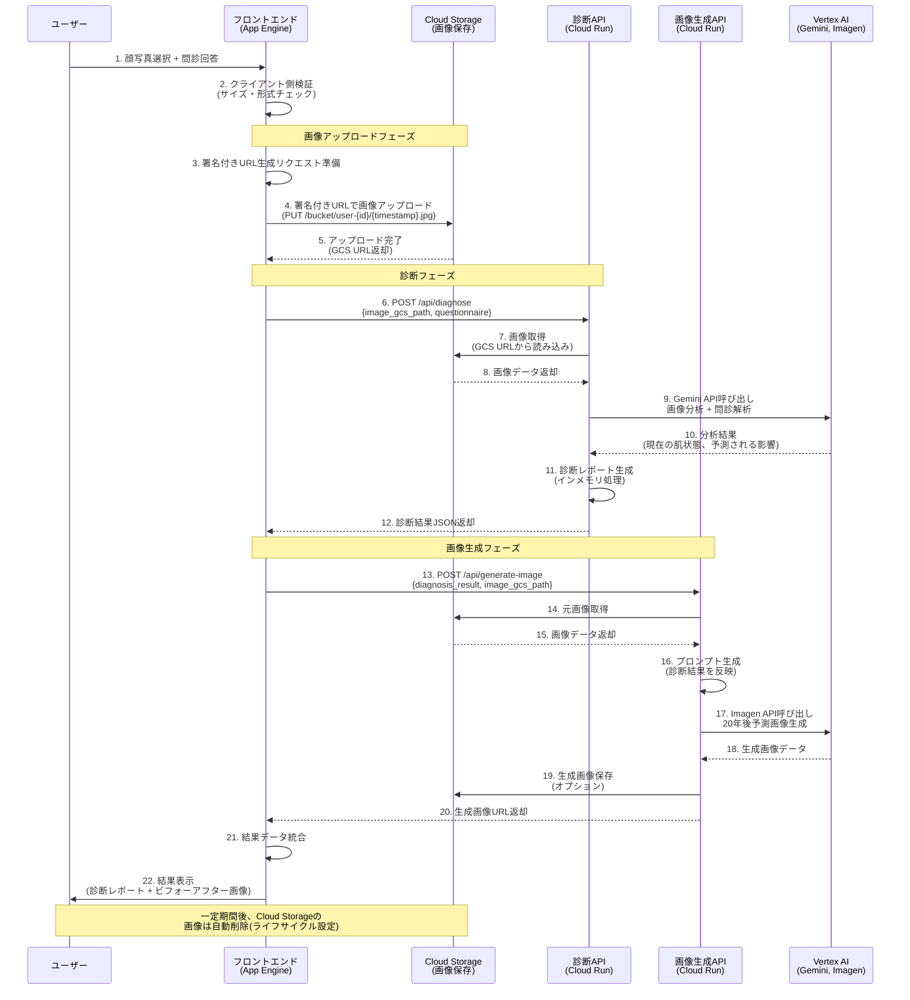

# システムアーキテクチャ

## 1. シーケンス図

### 構成概要

フロントエンド：React, Vite, Typescript, MUI, App Engine
バックエンド：

- 診断 API：Cloud Run（コンテナ）
- 画像生成 API：Cloud RUn（コンテナ）
- 画像保存（一時保存）：CLoud Storage
- AI モデル：VertexAI
  - テキスト生成：Gemini-2.5-falsh
  - 画像生成：gemini-2.5-flash-image-preview
- API：fastAPI（悩み中、AWS API GAteway のように組み込みで簡単に構築できるならそちらで実施したい）

### 全体の処理フロー



## 2. 参考実装

### フロントと Cloud Storage とのやりとりあれこれ

```
import { Storage } from '@google-cloud/storage';
import { v4 as uuidv4 } from 'uuid';

// Cloud Storage クライアントの初期化
const storage = new Storage({
  projectId: process.env.GCP_PROJECT_ID,
});

const BUCKET_NAME = process.env.GCS_BUCKET_NAME || 'smoking-impact-images';

interface SignedUrlResponse {
  uploadUrl: string;
  filePath: string;
  downloadUrl: string;
}

/**
 * 画像アップロード用の署名付きURLを生成
 * @param userId ユーザーID（セッションIDやUUID）
 * @param contentType アップロードするファイルのMIMEタイプ
 * @returns 署名付きURLとファイルパス
 */
export async function generateUploadSignedUrl(
  userId: string,
  contentType: string = 'image/jpeg'
): Promise<SignedUrlResponse> {
  try {
    const timestamp = Date.now();
    const uniqueId = uuidv4();
    const fileName = `${userId}_${timestamp}_${uniqueId}.jpg`;
    const filePath = `uploads/${userId}/${fileName}`;

    const bucket = storage.bucket(BUCKET_NAME);
    const file = bucket.file(filePath);

    // アップロード用署名付きURL生成（15分間有効）
    const [uploadUrl] = await file.getSignedUrl({
      version: 'v4',
      action: 'write',
      expires: Date.now() + 15 * 60 * 1000, // 15分
      contentType: contentType,
      extensionHeaders: {
        'x-goog-content-length-range': '0,10485760', // 最大10MB
      },
    });

    // ダウンロード用署名付きURL生成（1時間有効）
    const [downloadUrl] = await file.getSignedUrl({
      version: 'v4',
      action: 'read',
      expires: Date.now() + 60 * 60 * 1000, // 1時間
    });

    return {
      uploadUrl,
      filePath,
      downloadUrl,
    };
  } catch (error) {
    console.error('Error generating signed URL:', error);
    throw new Error('Failed to generate upload URL');
  }
}

/**
 * App Engine APIエンドポイント例（Express.js/Next.js API Route）
 */
export async function handleGenerateUploadUrl(req: any, res: any) {
  try {
    // ユーザーIDの取得（セッション、JWT、IPアドレスなどから）
    const userId = req.session?.userId || req.ip || uuidv4();

    // Content-Typeの検証
    const contentType = req.body?.contentType || 'image/jpeg';
    const allowedTypes = ['image/jpeg', 'image/png', 'image/webp'];

    if (!allowedTypes.includes(contentType)) {
      return res.status(400).json({
        error: 'Invalid content type. Allowed: JPEG, PNG, WebP',
      });
    }

    const signedUrlData = await generateUploadSignedUrl(userId, contentType);

    res.status(200).json({
      success: true,
      data: signedUrlData,
    });
  } catch (error) {
    console.error('API Error:', error);
    res.status(500).json({
      success: false,
      error: 'Failed to generate upload URL',
    });
  }
}

/**
 * 画像ファイルの検証
 */
export async function verifyUploadedImage(filePath: string): Promise<boolean> {
  try {
    const bucket = storage.bucket(BUCKET_NAME);
    const file = bucket.file(filePath);

    const [exists] = await file.exists();
    if (!exists) {
      return false;
    }

    const [metadata] = await file.getMetadata();

    // ファイルサイズチェック（10MB以下）
    const maxSize = 10 * 1024 * 1024;
    if (metadata.size && metadata.size > maxSize) {
      await file.delete(); // サイズ超過の場合は削除
      return false;
    }

    // Content-Typeチェック
    const allowedTypes = ['image/jpeg', 'image/png', 'image/webp'];
    if (!allowedTypes.includes(metadata.contentType || '')) {
      await file.delete(); // 不正なファイル形式は削除
      return false;
    }

    return true;
  } catch (error) {
    console.error('Error verifying uploaded image:', error);
    return false;
  }
}

/**
 * Cloud Storageから画像データを取得
 * @param filePath GCSファイルパス
 * @returns 画像データ（Buffer）
 */
export async function getImageFromGCS(filePath: string): Promise<Buffer> {
  try {
    const bucket = storage.bucket(BUCKET_NAME);
    const file = bucket.file(filePath);

    const [buffer] = await file.download();
    return buffer;
  } catch (error) {
    console.error('Error downloading image from GCS:', error);
    throw new Error('Failed to download image from Cloud Storage');
  }
}

```

### フロントから Cloud Run の API を呼び出す

```

```

### フロントとバックエンドの関係性詳細

```
ユーザー
   ↓
App Engine (静的ホスティングのみ)
   ├── index.html
   ├── assets/*.js
   └── assets/*.css

   ↓ API呼び出し

Cloud Functions (generateUploadUrl)
   ↓
Cloud Storage

   ↓ 処理依頼

Cloud Run (診断API)
Cloud Run (画像生成API)
```
