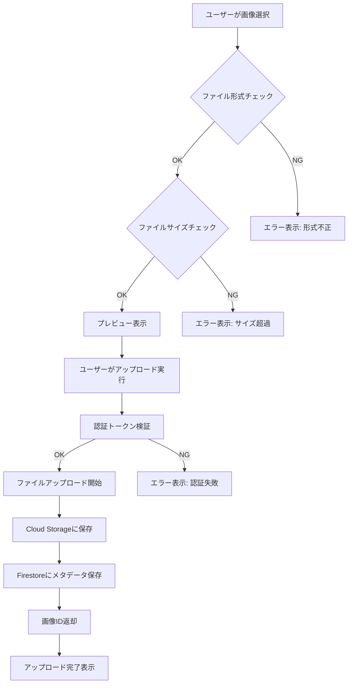

# 詳細設計書

## はじめに

本文書は、要件定義書（docs/01-requirements.md）およびシステムアーキテクチャ（docs/02-system-architecture.md）に基づく詳細設計を記述したものです。各設計項目は要件 ID とのトレーサビリティを確保し、3〜4 時間程度で実装可能な単位で分割しています。

## 詳細設計項目一覧

| 設計 ID | 関連要件 | 設計名               | 実装優先度 | 実装時間目安 |
| ------- | -------- | -------------------- | ---------- | ------------ |
| DD-01   | FR-001   | 画像アップロード機能 | 高         | 3-4 時間     |

---

## DD-01: 画像アップロード機能

### 関連要件

- **要件 ID**: FR-001
- **要件名**: 画像アップロード機能
- **要件概要**: 利用者が画像をシステムにアップロードできる機能を提供

### 設計概要

利用者が Web アプリケーション上で画像をアップロードし、Cloud Storage に保存して Firestore にメタデータを記録する機能の詳細設計。ドラッグ&ドロップ、プレビュー、進捗表示などの UX 要件を満たしつつ、適切なバリデーションとエラーハンドリングを実装する。

**重要:** 本機能では顔写真以外の画像ファイルであってもアップロード処理を停止しません。画像形式（JPEG/PNG）とファイルサイズの要件を満たしていれば、どのような内容の画像でもアップロード可能です。

### 1. 処理フロー設計

#### 1.1 全体フロー



#### 1.2 詳細処理ステップ

| ステップ | 処理内容                     | 責任コンポーネント  | 処理時間目安 |
| -------- | ---------------------------- | ------------------- | ------------ |
| 1        | ファイル選択（D&D 対応）     | フロントエンド      | 即座         |
| 2        | クライアント側バリデーション | フロントエンド      | < 100ms      |
| 3        | プレビュー画像生成           | フロントエンド      | < 200ms      |
| 4        | マルチパートアップロード     | フロントエンド →API | 1-10 秒      |
| 5        | サーバー側バリデーション     | バックエンド API    | < 100ms      |
| 6        | Cloud Storage 保存           | バックエンド API    | 1-3 秒       |
| 7        | Firestore メタデータ保存     | バックエンド API    | < 500ms      |
| 8        | レスポンス返却               | バックエンド API    | < 100ms      |

### 2. データ構造設計

#### 2.1 リクエストデータ構造

```typescript
// マルチパートフォームデータ
interface UploadImageRequest {
  file: File;                    // 画像ファイル（JPEG/PNG）
  sessionId?: string;           // セッションID（オプション）
}

// ファイルバリデーション仕様
interface FileValidation {
  allowedTypes: ['image/jpeg', 'image/png'];
  maxSize: 10 * 1024 * 1024;    // 10MB
  minSize: 1024;                // 1KB
}
```

#### 2.2 レスポンスデータ構造

```typescript
// 成功レスポンス
interface UploadImageResponse {
	success: true;
	data: {
		imageId: string; // 生成された画像ID
		sessionId: string; // セッションID
		uploadedAt: string; // ISO8601形式タイムスタンプ
		originalUrl: string; // Cloud Storage URL
		metadata: {
			filename: string; // オリジナルファイル名
			contentType: string; // MIMEタイプ
			size: number; // ファイルサイズ（バイト）
			dimensions: {
				// 画像サイズ
				width: number;
				height: number;
			};
		};
	};
}

// エラーレスポンス
interface UploadImageError {
	success: false;
	error: {
		code: string; // エラーコード
		message: string; // エラーメッセージ
		details?: any; // 詳細情報
	};
}
```

#### 2.3 Firestore データモデル

```typescript
// images/{imageId}コレクション
interface ImageDocument {
	imageId: string; // ドキュメントID
	sessionId: string; // セッションID
	userId: string; // Firebase Auth UID
	originalUrl: string; // Cloud Storage URL
	metadata: {
		filename: string;
		contentType: string;
		size: number;
		dimensions: {
			width: number;
			height: number;
		};
	};
	uploadedAt: Timestamp; // Firestore Timestamp
	createdAt: Timestamp;
	updatedAt: Timestamp;
}

// sessions/{sessionId}コレクション更新
interface SessionUpdate {
	imageId?: string; // アップロード完了時に設定
	status:
		| "uploading"
		| "image_uploaded"
		| "processing"
		| "completed"
		| "failed";
	updatedAt: Timestamp;
}
```

### 3. インターフェース設計

#### 3.1 REST API 仕様

```yaml
# POST /api/v1/upload-image
paths:
  /api/v1/upload-image:
    post:
      summary: 画像アップロード
      description: JPEG/PNG形式の画像をアップロードし、Cloud Storageに保存
      security:
        - bearerAuth: []
      requestBody:
        required: true
        content:
          multipart/form-data:
            schema:
              type: object
              properties:
                file:
                  type: string
                  format: binary
                  description: 画像ファイル（JPEG/PNG、最大10MB、顔写真以外も可）
                sessionId:
                  type: string
                  description: セッションID（オプション）
              required:
                - file
      responses:
        200:
          description: アップロード成功
          content:
            application/json:
              schema:
                $ref: "#/components/schemas/UploadImageResponse"
        400:
          description: バリデーションエラー
          content:
            application/json:
              schema:
                $ref: "#/components/schemas/UploadImageError"
        401:
          description: 認証エラー
        413:
          description: ファイルサイズ超過
        500:
          description: サーバーエラー
```

#### 3.2 WebSocket 進捗通知

```typescript
// WebSocket接続：/ws/upload/{sessionId}
interface UploadProgress {
	type: "upload_progress";
	data: {
		sessionId: string;
		stage: "validating" | "uploading" | "storing" | "saving" | "completed";
		progress: number; // 0-100
		message: string; // 進捗メッセージ
		timestamp: string; // ISO8601
	};
}

interface UploadError {
	type: "upload_error";
	data: {
		sessionId: string;
		error: {
			code: string;
			message: string;
		};
		timestamp: string;
	};
}
```

### 4. 画面仕様設計

#### 4.1 ImageUploader コンポーネント

```typescript
// React TypeScript コンポーネント設計
interface ImageUploaderProps {
	onUploadSuccess: (result: UploadImageResponse["data"]) => void;
	onUploadError: (error: UploadImageError["error"]) => void;
	sessionId?: string;
	disabled?: boolean;
}

interface ImageUploaderState {
	dragOver: boolean; // ドラッグオーバー状態
	selectedFile: File | null; // 選択されたファイル
	previewUrl: string | null; // プレビューURL
	uploading: boolean; // アップロード中フラグ
	progress: number; // アップロード進捗（0-100）
	currentStage: string; // 現在の処理ステージ
	error: string | null; // エラーメッセージ
}
```

#### 4.2 UI 構成

```typescript
// Material-UI コンポーネント構成
const ImageUploader: React.FC<ImageUploaderProps> = () => {
	return (
		<Box sx={{ p: 3 }}>
			{/* ファイル選択エリア */}
			<Paper
				variant="outlined"
				sx={{
					p: 4,
					textAlign: "center",
					cursor: "pointer",
					backgroundColor: dragOver ? "action.hover" : "background.paper",
					borderStyle: dragOver ? "solid" : "dashed",
					borderColor: dragOver ? "primary.main" : "divider",
					borderWidth: 2,
				}}
				onDrop={handleDrop}
				onDragOver={handleDragOver}
				onDragLeave={handleDragLeave}
				onClick={handleClick}
			>
				{/* ドラッグ&ドロップエリア */}
				<input
					type="file"
					ref={fileInputRef}
					style={{ display: "none" }}
					accept="image/jpeg,image/png"
					onChange={handleFileSelect}
				/>

				{!selectedFile ? (
					<Box>
						<CloudUploadIcon
							sx={{ fontSize: 48, color: "text.secondary", mb: 2 }}
						/>
						<Typography variant="h6" gutterBottom>
							画像をアップロード
						</Typography>
						<Typography variant="body2" color="text.secondary">
							ここにファイルをドラッグ&ドロップするか、クリックして選択
						</Typography>
						<Typography
							variant="caption"
							display="block"
							sx={{ mt: 0.5, color: "info.main" }}
						>
							注意: 顔写真以外の画像もアップロード可能です
						</Typography>
						<Typography variant="caption" display="block" sx={{ mt: 1 }}>
							対応形式: JPEG, PNG（最大10MB）
						</Typography>
					</Box>
				) : (
					<Box>
						{/* プレビュー表示 */}
						
						<Typography variant="body2" sx={{ mt: 1 }}>
							{selectedFile.name} ({formatFileSize(selectedFile.size)})
						</Typography>
					</Box>
				)}
			</Paper>

			{/* アップロード進捗 */}
			{uploading && (
				<Box sx={{ mt: 2 }}>
					<LinearProgress variant="determinate" value={progress} />
					<Typography variant="body2" align="center" sx={{ mt: 1 }}>
						{currentStage} ({progress}%)
					</Typography>
				</Box>
			)}

			{/* エラー表示 */}
			{error && (
				<Alert severity="error" sx={{ mt: 2 }}>
					{error}
				</Alert>
			)}

			{/* アクションボタン */}
			<Box sx={{ mt: 2, display: "flex", gap: 2, justifyContent: "center" }}>
				{selectedFile && !uploading && (
					<>
						<Button variant="outlined" onClick={handleClear}>
							クリア
						</Button>
						<Button
							variant="contained"
							onClick={handleUpload}
							disabled={!selectedFile || uploading}
						>
							アップロード開始
						</Button>
					</>
				)}
			</Box>
		</Box>
	);
};
```

#### 4.3 バリデーション仕様

```typescript
// クライアント側バリデーション
const validateFile = (file: File): string | null => {
	// ファイル形式チェック
	const allowedTypes = ["image/jpeg", "image/png"];
	if (!allowedTypes.includes(file.type)) {
		return "JPEG またはPNG形式のファイルを選択してください";
	}

	// ファイルサイズチェック
	const maxSize = 10 * 1024 * 1024; // 10MB
	const minSize = 1024; // 1KB
	if (file.size > maxSize) {
		return `ファイルサイズが大きすぎます（最大: ${formatFileSize(maxSize)}）`;
	}
	if (file.size < minSize) {
		return "ファイルサイズが小さすぎます";
	}

	return null; // バリデーション成功
};

// プレビュー生成
const generatePreview = (file: File): Promise<string> => {
	return new Promise((resolve) => {
		const reader = new FileReader();
		reader.onload = (e) => resolve(e.target?.result as string);
		reader.readAsDataURL(file);
	});
};
```

### 5. エラーハンドリング設計

#### 5.1 エラー分類

| エラーカテゴリ | エラーコード      | HTTP ステータス | メッセージ                     | 対処方法                     |
| -------------- | ----------------- | --------------- | ------------------------------ | ---------------------------- |
| バリデーション | INVALID_FILE_TYPE | 400             | 対応していないファイル形式です | 形式変更を促す               |
| バリデーション | FILE_TOO_LARGE    | 413             | ファイルサイズが大きすぎます   | サイズ縮小を促す             |
| バリデーション | FILE_TOO_SMALL    | 400             | ファイルサイズが小さすぎます   | 別ファイル選択を促す         |
| 認証           | UNAUTHORIZED      | 401             | 認証が必要です                 | ログインページへリダイレクト |
| システム       | STORAGE_ERROR     | 500             | ファイル保存に失敗しました     | リトライを促す               |
| システム       | DATABASE_ERROR    | 500             | データ保存に失敗しました       | リトライを促す               |

#### 5.2 エラーハンドリング実装

```python
# バックエンド エラーハンドリング
from fastapi import HTTPException
from enum import Enum

class ErrorCode(str, Enum):
    INVALID_FILE_TYPE = "INVALID_FILE_TYPE"
    FILE_TOO_LARGE = "FILE_TOO_LARGE"
    FILE_TOO_SMALL = "FILE_TOO_SMALL"
    STORAGE_ERROR = "STORAGE_ERROR"
    DATABASE_ERROR = "DATABASE_ERROR"

class UploadException(Exception):
    def __init__(self, code: ErrorCode, message: str, status_code: int = 400):
        self.code = code
        self.message = message
        self.status_code = status_code
        super().__init__(message)

# エラーレスポンス生成
def create_error_response(error: UploadException):
    raise HTTPException(
        status_code=error.status_code,
        detail={
            "success": False,
            "error": {
                "code": error.code,
                "message": error.message
            }
        }
    )

# 画像基本バリデーション例
async def validate_image_basic(file_content: bytes):
    """画像ファイルの基本的な検証"""
    try:
        image = Image.open(BytesIO(file_content))
        image.verify()  # 画像の整合性チェック
        return True
    except Exception:
        raise UploadException(
            ErrorCode.INVALID_FILE_TYPE,
            "画像ファイルが破損している可能性があります",
            400
        )
```

```typescript
// フロントエンド エラーハンドリング
interface ErrorHandler {
	showError(error: UploadImageError["error"]): void;
	getRetryAction(errorCode: string): string | null;
}

const useErrorHandler = (): ErrorHandler => {
	const { enqueueSnackbar } = useSnackbar();

	const showError = (error: UploadImageError["error"]) => {
		const userMessage = getUserFriendlyMessage(error.code);
		enqueueSnackbar(userMessage, { variant: "error" });
	};

	const getRetryAction = (errorCode: string): string | null => {
		const retryableErrors = [
			"STORAGE_ERROR",
			"VISION_API_ERROR",
			"DATABASE_ERROR",
		];

		return retryableErrors.includes(errorCode) ? "retry" : null;
	};

	return { showError, getRetryAction };
};

// ユーザーフレンドリーメッセージ変換
const getUserFriendlyMessage = (errorCode: string): string => {
	const messages = {
		INVALID_FILE_TYPE: "JPEGまたはPNG形式のファイルを選択してください",
		FILE_TOO_LARGE: "ファイルサイズが大きすぎます（最大10MB）",
		FILE_TOO_SMALL: "ファイルサイズが小さすぎます",
		NO_FACE_DETECTED: "顔が検出されませんでした。別の写真をお試しください",
		MULTIPLE_FACES:
			"複数の顔が検出されました。一人だけが写った写真をご使用ください",
		STORAGE_ERROR:
			"ファイルの保存に失敗しました。しばらく時間をおいて再度お試しください",
		VISION_API_ERROR:
			"画像の解析に失敗しました。しばらく時間をおいて再度お試しください",
		DATABASE_ERROR:
			"データの保存に失敗しました。しばらく時間をおいて再度お試しください",
	};

	return messages[errorCode] || "予期しないエラーが発生しました";
};
```

### 6. セキュリティ設計

#### 6.1 認証・認可

```python
# Firebase認証検証
from firebase_admin import auth
from fastapi import Depends, HTTPException
from fastapi.security import HTTPBearer

security = HTTPBearer()

async def verify_firebase_token(token: str = Depends(security)):
    try:
        decoded_token = auth.verify_id_token(token.credentials)
        return decoded_token
    except Exception as e:
        raise HTTPException(
            status_code=401,
            detail={"error": {"code": "UNAUTHORIZED", "message": "認証が必要です"}}
        )

# アップロードエンドポイントでの認証適用
@router.post("/upload-image")
async def upload_image(
    file: UploadFile,
    user: dict = Depends(verify_firebase_token)
):
    # 認証済みユーザーのみアクセス可能
    user_id = user["uid"]
    # ... 処理続行
```

#### 6.2 ファイルセキュリティ

```python
# ファイル内容検証
import magic
from PIL import Image

async def validate_file_content(file: UploadFile):
    """ファイル内容の詳細検証"""

    # MIMEタイプ検証（libmagic使用）
    file_content = await file.read()
    await file.seek(0)  # ファイルポインタをリセット

    detected_type = magic.from_buffer(file_content, mime=True)
    if detected_type not in ['image/jpeg', 'image/png']:
        raise UploadException(
            ErrorCode.INVALID_FILE_TYPE,
            f"ファイル内容が不正です。検出タイプ: {detected_type}"
        )

    # 画像ファイルとして正常に読み込めるかチェック
    try:
        image = Image.open(file.file)
        image.verify()  # 画像の整合性チェック
    except Exception:
        raise UploadException(
            ErrorCode.INVALID_FILE_TYPE,
            "画像ファイルが破損している可能性があります"
        )

    return True
```

### 7. パフォーマンス設計

#### 7.1 ファイルアップロード最適化

```python
# 非同期アップロード処理
import asyncio
from google.cloud import storage
from google.cloud import vision

async def process_image_upload(file: UploadFile, user_id: str, session_id: str):
    """画像アップロード処理"""

    # 1. 初期バリデーション（高速）
    await validate_file_basic(file)

    # 2. ファイル内容読み込み
    file_content = await file.read()

    # 3. Cloud Storageへアップロード
    storage_url = await upload_to_storage(file_content, file.filename, session_id)

    # 4. 画像メタデータ作成
    from PIL import Image
    from io import BytesIO

    image = Image.open(BytesIO(file_content))
    width, height = image.size

    metadata = {
        "filename": file.filename,
        "contentType": file.content_type,
        "size": len(file_content),
        "dimensions": {
            "width": width,
            "height": height
        }
    }

    # 5. Firestoreに保存
    image_id = await save_image_metadata(
        user_id=user_id,
        session_id=session_id,
        storage_url=storage_url,
        metadata=metadata
    )

    return {
        "imageId": image_id,
        "sessionId": session_id,
        "originalUrl": storage_url,
        "metadata": metadata
    }
```

#### 7.2 Cloud Storage 設定

```python
# 効率的なストレージ設定
from google.cloud import storage

def get_storage_client():
    client = storage.Client()
    bucket = client.bucket("no-smoking-hackathon-bucket")

    # アップロード最適化設定
    bucket.patch({
        "storageClass": "STANDARD",  # 高速アクセス
        "location": "asia-northeast1"  # 低レイテンシ
    })

    return bucket

async def upload_to_storage(file_content: bytes, filename: str, session_id: str) -> str:
    """効率的なCloud Storageアップロード"""
    bucket = get_storage_client()

    # ファイルパス生成
    blob_name = f"uploads/{session_id}/original.jpg"
    blob = bucket.blob(blob_name)

    # メタデータ設定
    blob.metadata = {
        "originalFilename": filename,
        "sessionId": session_id,
        "uploadedAt": datetime.utcnow().isoformat()
    }

    # アップロード実行
    blob.upload_from_string(
        file_content,
        content_type="image/jpeg",
        timeout=30  # タイムアウト設定
    )

    return blob.public_url
```

### 8. テスト設計

#### 8.1 ユニットテスト

```python
# pytest テストケース
import pytest
from fastapi.testclient import TestClient
from main import app

client = TestClient(app)

class TestImageUpload:
    """画像アップロード機能のテスト"""

    def test_valid_image_upload(self, mock_auth_token):
        """正常な画像アップロードのテスト"""
        with open("tests/fixtures/test_image.jpg", "rb") as f:
            response = client.post(
                "/api/v1/upload-image",
                files={"file": ("test.jpg", f, "image/jpeg")},
                headers={"Authorization": f"Bearer {mock_auth_token}"}
            )

        assert response.status_code == 200
        data = response.json()
        assert data["success"] is True
        assert "imageId" in data["data"]
        assert "sessionId" in data["data"]

    def test_invalid_file_type(self, mock_auth_token):
        """不正ファイル形式のテスト"""
        with open("tests/fixtures/test.txt", "rb") as f:
            response = client.post(
                "/api/v1/upload-image",
                files={"file": ("test.txt", f, "text/plain")},
                headers={"Authorization": f"Bearer {mock_auth_token}"}
            )

        assert response.status_code == 400
        data = response.json()
        assert data["success"] is False
        assert data["error"]["code"] == "INVALID_FILE_TYPE"

    def test_file_too_large(self, mock_auth_token):
        """ファイルサイズ超過のテスト"""
        # 11MBのダミーファイル作成
        large_content = b"x" * (11 * 1024 * 1024)

        response = client.post(
            "/api/v1/upload-image",
            files={"file": ("large.jpg", large_content, "image/jpeg")},
            headers={"Authorization": f"Bearer {mock_auth_token}"}
        )

        assert response.status_code == 413
```

#### 8.2 統合テスト

```typescript
// フロントエンド E2Eテスト（Cypress）
describe("画像アップロード機能", () => {
	beforeEach(() => {
		cy.login(); // 認証ヘルパー
		cy.visit("/upload");
	});

	it("正常な画像アップロードフロー", () => {
		// ファイル選択
		cy.get('[data-testid="file-input"]').selectFile(
			"cypress/fixtures/test_image.jpg"
		);

		// プレビュー表示確認
		cy.get('[data-testid="preview-image"]').should("be.visible");
		cy.get('[data-testid="file-info"]').should("contain", "test_image.jpg");

		// アップロード実行
		cy.get('[data-testid="upload-button"]').click();

		// 進捗表示確認
		cy.get('[data-testid="progress-bar"]').should("be.visible");
		cy.get('[data-testid="progress-message"]').should(
			"contain",
			"アップロード中"
		);

		// 完了確認
		cy.get('[data-testid="success-message"]', { timeout: 30000 }).should(
			"contain",
			"アップロードが完了しました"
		);
	});

	it("ドラッグ&ドロップによるファイル選択", () => {
		// ドラッグエリアの確認
		cy.get('[data-testid="drop-zone"]').should("be.visible");

		// ファイルをドラッグ&ドロップ
		cy.get('[data-testid="drop-zone"]').selectFile(
			"cypress/fixtures/test_image.jpg",
			{ action: "drag-drop" }
		);

		// プレビュー表示確認
		cy.get('[data-testid="preview-image"]').should("be.visible");
	});

	it("不正ファイル形式エラー表示", () => {
		// テキストファイルを選択
		cy.get('[data-testid="file-input"]').selectFile(
			"cypress/fixtures/test.txt"
		);

		// エラーメッセージ確認
		cy.get('[data-testid="error-message"]').should(
			"contain",
			"JPEG またはPNG形式のファイルを選択してください"
		);
	});
});
```

### 9. 実装チェックリスト

#### 9.1 フロントエンド実装項目

- [ ] ImageUploader コンポーネント作成
- [ ] ドラッグ&ドロップ機能実装
- [ ] ファイルバリデーション実装
- [ ] プレビュー表示機能実装
- [ ] アップロード進捗表示実装
- [ ] エラーハンドリング実装
- [ ] WebSocket 進捗通知実装
- [ ] レスポンシブデザイン対応

#### 9.2 バックエンド実装項目

- [ ] FastAPI ルーター作成（upload.py）
- [ ] Firebase 認証ミドルウェア実装
- [ ] ファイルバリデーション実装
- [ ] Cloud Storage 連携実装
- [ ] Firestore 操作実装
- [ ] WebSocket 進捗通知実装
- [ ] エラーハンドリング実装

#### 9.3 インフラ実装項目

- [ ] Cloud Storage バケット作成
- [ ] Firestore コレクション設計実装
- [ ] Firebase Authentication 設定
- [ ] Cloud Run デプロイ設定
- [ ] CORS 設定
- [ ] セキュリティルール設定

### 10. 実装時の注意事項

1. **認証トークン**：全 API リクエストで Firebase ID Token の検証を必須とする
2. **ファイルサイズ制限**：Cloud Run のリクエストサイズ制限（32MB）を考慮
3. **タイムアウト設定**：Cloud Run の最大実行時間（60 分）内で処理完了を保証
4. **エラーログ**：Cloud Logging に詳細なエラー情報を記録
5. **レート制限**：SlowAPI による基本的なレート制限を実装
6. **リソース管理**：アップロード後のメモリ解放を適切に実行

---

## おわりに

本詳細設計（DD-01）は、FR-001 要件「画像アップロード機能」を 3-4 時間で実装可能な単位で設計しています。実装時は本設計書に記載された仕様に従い、チェックリストを活用して漏れのない開発を進めてください。
