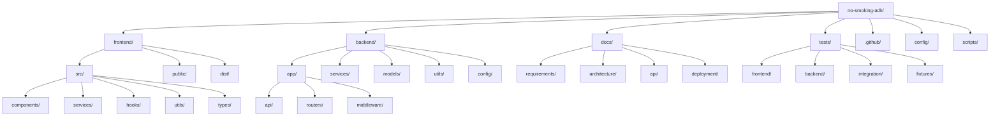
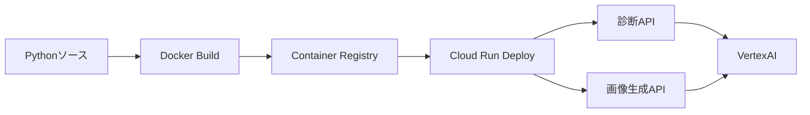
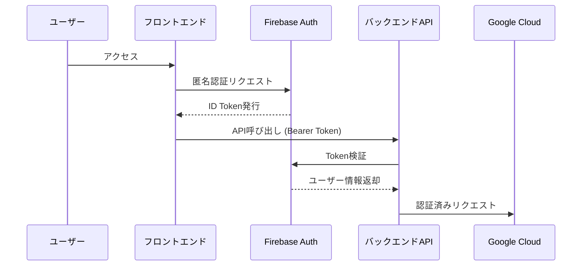

# フォルダ構成・アーキテクチャ設計書

## 1. プロジェクト概要

### 1.1 システム概要

禁煙支援アプリケーション「no-smoking-for-you」は、AI を活用した顔写真分析による喫煙影響診断システムです。ユーザーの顔写真と問診情報から現在の肌状態を分析し、20 年後の予測画像を生成することで禁煙動機の向上を支援します。

### 1.2 設計方針

- **モノリシック構成**: 単一リポジトリ内でフロントエンド・バックエンド・テスト・ドキュメントを統合管理
- **マイクロサービス指向**: バックエンドは機能別に API サービスを分離（診断 API、画像生成 API）
- **クラウドネイティブ**: Google Cloud Platform 上での完全なサーバーレス構成
- **セキュリティファースト**: プライバシー保護とデータ最小化を最優先
- **開発効率重視**: 明確なディレクトリ構造と責務分離による保守性確保

## 2. 最適化されたフォルダ構成

### 2.1 全体構成図



### 2.2 詳細ディレクトリ構成

```
no-smoking-adk/
├── README.md                           # プロジェクト概要
├── .gitignore                          # Git除外設定
├── pyrightconfig.json                  # Python型チェック設定
├──
├── frontend/                           # フロントエンドアプリケーション
│   ├── package.json                    # Node.js依存関係
│   ├── vite.config.ts                 # Vite設定
│   ├── tsconfig.json                  # TypeScript設定
│   ├── firebase.json                  # Firebase設定
│   ├── .firebaserc                    # Firebase環境設定
│   ├──
│   ├── public/                        # 静的資産
│   │   ├── index.html                 # メインHTMLテンプレート
│   │   ├── favicon.ico               # ファビコン
│   │   └── robots.txt                # クローラー設定
│   ├──
│   ├── src/                          # ソースコード
│   │   ├── main.tsx                  # アプリケーションエントリーポイント
│   │   ├── App.tsx                   # メインアプリケーションコンポーネント
│   │   ├── index.css                 # グローバルスタイル
│   │   ├── vite-env.d.ts            # Vite型定義
│   │   ├──
│   │   ├── components/               # UIコンポーネント
│   │   │   ├── ImageUploader.tsx     # 画像アップロード
│   │   │   ├── QuestionnaireForm.tsx # 問診フォーム
│   │   │   ├── ProcessingStatus.tsx  # 処理状況表示
│   │   │   ├── ResultDisplay.tsx     # 結果表示
│   │   │   ├── common/               # 共通コンポーネント
│   │   │   │   ├── Button.tsx
│   │   │   │   ├── Modal.tsx
│   │   │   │   └── Loading.tsx
│   │   │   └── layout/               # レイアウトコンポーネント
│   │   │       ├── Header.tsx
│   │   │       ├── Footer.tsx
│   │   │       └── Layout.tsx
│   │   ├──
│   │   ├── hooks/                    # カスタムReactフック
│   │   │   ├── useApi.ts            # API通信フック
│   │   │   ├── useAuth.ts           # 認証フック
│   │   │   ├── useWebSocket.ts      # WebSocket通信フック
│   │   │   └── useLocalStorage.ts   # ローカルストレージフック
│   │   ├──
│   │   ├── services/                 # 外部サービス連携
│   │   │   ├── api.ts               # API クライアント
│   │   │   ├── auth.ts              # 認証サービス
│   │   │   ├── storage.ts           # ストレージサービス
│   │   │   └── websocket.ts         # WebSocket サービス
│   │   ├──
│   │   ├── types/                    # 型定義
│   │   │   ├── api.ts               # API レスポンス型
│   │   │   ├── user.ts              # ユーザー関連型
│   │   │   ├── questionnaire.ts     # 問診関連型
│   │   │   └── result.ts            # 結果関連型
│   │   ├──
│   │   ├── utils/                    # ユーティリティ関数
│   │   │   ├── validation.ts        # バリデーション
│   │   │   ├── formatting.ts        # データフォーマット
│   │   │   ├── constants.ts         # 定数定義
│   │   │   └── helpers.ts           # ヘルパー関数
│   │   └──
│   │   └── pages/                    # ページコンポーネント
│   │       ├── Home.tsx             # ホームページ
│   │       ├── Upload.tsx           # アップロードページ
│   │       ├── Questionnaire.tsx    # 問診ページ
│   │       ├── Processing.tsx       # 処理中ページ
│   │       └── Result.tsx           # 結果ページ
│   └──
│   └── dist/                         # ビルド出力（自動生成）
│
├── backend/                          # バックエンドアプリケーション
│   ├── .venv/                       # Python仮想環境（除外対象）
│   ├── requirements.txt             # Python依存関係
│   ├── Dockerfile                   # Dockerコンテナ定義
│   ├── main.py                      # FastAPIメインアプリケーション
│   ├──
│   ├── app/                         # アプリケーションコア
│   │   ├── __init__.py             # パッケージ初期化
│   │   ├──
│   │   ├── api/                     # APIエンドポイント
│   │   │   ├── __init__.py
│   │   │   ├── v1/                  # APIバージョン1
│   │   │   │   ├── __init__.py
│   │   │   │   ├── diagnose.py     # 診断API
│   │   │   │   ├── generate.py     # 画像生成API
│   │   │   │   ├── upload.py       # ファイルアップロードAPI
│   │   │   │   └── session.py      # セッション管理API
│   │   │   └──
│   │   │   └── middleware/          # ミドルウェア
│   │   │       ├── __init__.py
│   │   │       ├── auth.py          # 認証ミドルウェア
│   │   │       ├── cors.py          # CORS設定
│   │   │       ├── logging.py       # ログ設定
│   │   │       └── rate_limit.py    # レート制限
│   │   ├──
│   │   ├── services/                # ビジネスロジック
│   │   │   ├── __init__.py
│   │   │   ├── diagnose_service.py  # 診断処理サービス
│   │   │   ├── image_service.py     # 画像処理サービス
│   │   │   ├── ai_service.py        # AI連携サービス
│   │   │   ├── storage_service.py   # ストレージサービス
│   │   │   └── session_service.py   # セッション管理サービス
│   │   ├──
│   │   ├── models/                  # データモデル
│   │   │   ├── __init__.py
│   │   │   ├── questionnaire.py     # 問診データモデル
│   │   │   ├── diagnosis.py         # 診断結果モデル
│   │   │   ├── session.py           # セッションモデル
│   │   │   └── response.py          # レスポンスモデル
│   │   ├──
│   │   ├── utils/                   # ユーティリティ
│   │   │   ├── __init__.py
│   │   │   ├── validation.py        # バリデーション
│   │   │   ├── image_processing.py  # 画像処理
│   │   │   ├── encryption.py        # 暗号化処理
│   │   │   └── logger.py           # ロガー設定
│   │   └──
│   │   └── config/                  # 設定管理
│   │       ├── __init__.py
│   │       ├── settings.py          # アプリケーション設定
│   │       ├── database.py          # データベース設定
│   │       ├── gcp.py              # Google Cloud設定
│   │       └── ai.py               # AI設定
│   └──
│   └── agents/                      # ADK Agentディレクトリ
│       └── (ADK関連ファイル)       # 自動生成されるエージェント
│
├── docs/                            # プロジェクトドキュメント
│   ├── 00-system-summary.md         # システム概要
│   ├── 01-requirements.md           # 要件仕様書
│   ├── 02-system-architecture.md    # システムアーキテクチャ
│   ├── 03-detail-design.md          # 詳細設計書
│   ├── 05-agent-strategy.md         # エージェント戦略
│   ├── 06-agent-implement.md        # エージェント実装
│   ├── 07-folder-architecture.md    # 本文書
│   ├── 08-api-specification.md      # API仕様書
│   ├── 09-deployment-guide.md       # デプロイ手順書
│   └── 10-operation-manual.md       # 運用マニュアル
│
├── tests/                           # テストスイート
│   ├── __init__.py                  # テストパッケージ初期化
│   ├── conftest.py                  # pytest設定
│   ├──
│   ├── backend/                     # バックエンドテスト
│   │   ├── __init__.py
│   │   ├── test_basic.py           # 基本機能テスト
│   │   ├── api/                     # APIテスト
│   │   │   ├── __init__.py
│   │   │   ├── test_diagnose.py    # 診断APIテスト
│   │   │   ├── test_generate.py    # 画像生成APIテスト
│   │   │   └── test_upload.py      # アップロードAPIテスト
│   │   ├── services/                # サービステスト
│   │   │   ├── __init__.py
│   │   │   ├── test_diagnose_service.py
│   │   │   └── test_image_service.py
│   │   └── fixtures/                # テストデータ
│   │       ├── test_image.jpg
│   │       └── sample_data.json
│   ├──
│   ├── frontend/                    # フロントエンドテスト
│   │   ├── cypress/                 # E2Eテスト
│   │   │   ├── cypress.config.ts   # Cypress設定
│   │   │   ├── fixtures/           # テストデータ
│   │   │   │   └── test_image.jpg
│   │   │   ├── integration/        # 統合テスト
│   │   │   │   └── upload.spec.ts
│   │   │   └── support/            # テストサポート
│   │   │       ├── commands.ts
│   │   │       └── index.ts
│   │   └── unit/                    # 単体テスト
│   │       ├── components/
│   │       ├── hooks/
│   │       └── services/
│   └──
│   └── integration/                 # 統合テスト
│       ├── __init__.py
│       ├── test_full_flow.py        # エンドツーエンドテスト
│       └── test_api_integration.py  # API統合テスト
│
├── config/                          # 設定ファイル
│   ├── environments/                # 環境別設定
│   │   ├── development.yaml         # 開発環境
│   │   ├── staging.yaml             # ステージング環境
│   │   └── production.yaml          # 本番環境
│   ├── gcp/                         # Google Cloud設定
│   │   ├── cloud-run/              # Cloud Run設定
│   │   │   ├── diagnosis-api.yaml
│   │   │   └── image-gen-api.yaml
│   │   ├── cloud-build/            # Cloud Build設定
│   │   │   ├── frontend.yaml
│   │   │   └── backend.yaml
│   │   └── iam/                     # IAM設定
│   │       └── service-accounts.yaml
│   └── monitoring/                  # モニタリング設定
│       ├── alerts.yaml              # アラート設定
│       └── dashboards/              # ダッシュボード設定
│
├── scripts/                         # 運用スクリプト
│   ├── deploy/                      # デプロイスクリプト
│   │   ├── deploy-frontend.sh       # フロントエンドデプロイ
│   │   ├── deploy-backend.sh        # バックエンドデプロイ
│   │   └── deploy-all.sh           # 一括デプロイ
│   ├── setup/                       # セットアップスクリプト
│   │   ├── init-project.sh          # プロジェクト初期化
│   │   ├── setup-gcp.sh            # GCP環境構築
│   │   └── install-deps.sh         # 依存関係インストール
│   └── maintenance/                 # メンテナンススクリプト
│       ├── cleanup-storage.sh       # ストレージクリーンアップ
│       └── backup-data.sh          # データバックアップ
│
├── .github/                         # GitHub設定
│   └── workflows/                   # CI/CDワークフロー
│       ├── frontend-ci.yml          # フロントエンドCI
│       ├── backend-ci.yml           # バックエンドCI
│       ├── deploy-staging.yml       # ステージング デプロイ
│       └── deploy-production.yml    # 本番デプロイ
│
└── .roo/                           # Roo設定（開発ツール）
    ├── rules-code/                 # コーディングルール
    │   └── 01-general-rules.md    # 一般的なルール
    └── (その他Roo関連ファイル)
```

## 3. 各ディレクトリの詳細な役割・責務

### 3.1 フロントエンド (`frontend/`)

**主要技術**: Vite + React + TypeScript + MUI + Firebase

#### 責務

- ユーザーインターフェースの提供
- バックエンド API との通信
- 画像アップロードとプレビュー
- リアルタイム処理状況の表示
- レスポンシブデザインの実現

#### 重要ディレクトリ

- [`src/components/`](frontend/src/components): 再利用可能な UI コンポーネント
- [`src/services/`](frontend/src/services): 外部 API・サービス連携
- [`src/hooks/`](frontend/src/hooks): カスタム React フック
- [`src/types/`](frontend/src/types): TypeScript 型定義
- [`src/utils/`](frontend/src/utils): 共通ユーティリティ関数

#### デプロイ先

- **開発環境**: Firebase Hosting (開発用)
- **本番環境**: Google App Engine (本番用)

### 3.2 バックエンド (`backend/`)

**主要技術**: FastAPI + Python 3.12 + Google Cloud SDK + VertexAI

#### 責務

- RESTful API エンドポイントの提供
- 画像解析・診断処理
- AI 生成画像作成
- セッション管理（メモリベース）
- Cloud Storage 連携
- セキュリティ・認証処理

#### 重要ディレクトリ

- [`app/api/`](backend/app/api): API エンドポイント定義
- [`app/services/`](backend/app/services): ビジネスロジック
- [`app/models/`](backend/app/models): データモデル定義
- [`app/config/`](backend/app/config): 設定管理
- [`app/middleware/`](backend/app/middleware): 認証・CORS・ログ等

#### デプロイ先

- **診断 API**: Cloud Run コンテナ
- **画像生成 API**: Cloud Run コンテナ

### 3.3 ドキュメント (`docs/`)

#### 責務

- システム仕様・設計書の管理
- API 仕様書の提供
- 運用・保守手順の記録
- 開発ガイドラインの明記

#### 主要ファイル

- [`01-requirements.md`](docs/01-requirements.md): 完全詳細な要件仕様書
- [`02-system-architecture.md`](docs/02-system-architecture.md): システムアーキテクチャ
- [`03-detail-design.md`](docs/03-detail-design.md): 詳細設計書
- [`07-folder-architecture.md`](docs/07-folder-architecture.md): 本文書

### 3.4 テスト (`tests/`)

#### 責務

- 単体テスト・結合テスト・E2E テストの実行
- テストデータ・フィクスチャの管理
- 品質保証・回帰テスト

#### 重要ディレクトリ

- [`backend/`](tests/backend): バックエンドテスト (pytest)
- [`frontend/cypress/`](tests/frontend/cypress): フロントエンド E2E テスト (Cypress)
- [`integration/`](tests/integration): システム統合テスト
- [`fixtures/`](tests/backend/fixtures): テストデータ

## 4. ファイル命名規則・構造定義

### 4.1 命名規則

#### Python (バックエンド)

```python
# ファイル名: snake_case
# 例: diagnose_service.py, image_processing.py

# クラス名: PascalCase
class DiagnoseService:
class ImageProcessor:

# 関数・変数名: snake_case
def process_image(image_data: bytes) -> ProcessResult:
    session_id = generate_uuid()
```

#### TypeScript (フロントエンド)

```typescript
// ファイル名: PascalCase (コンポーネント)、camelCase (その他)
// 例: ImageUploader.tsx, api.ts

// コンポーネント名: PascalCase
const ImageUploader: React.FC<Props> = () => {};

// 関数・変数名: camelCase
const processImage = (imageFile: File): Promise<Result> => {};
```

#### ディレクトリ名

- 小文字 + ハイフン: `cloud-run/`, `service-accounts/`
- 複数形: `components/`, `services/`, `tests/`

### 4.2 インポート順序規則

#### Python

```python
# 1. 標準ライブラリ
import os
import json
from datetime import datetime

# 2. サードパーティ
from fastapi import FastAPI, HTTPException
from pydantic import BaseModel

# 3. ローカル（相対インポート）
from .models import DiagnosisModel
from .utils import validate_image
```

#### TypeScript

```typescript
// 1. React関連
import React, { useState, useEffect } from "react";

// 2. サードパーティ
import { Button, Box } from "@mui/material";

// 3. 内部モジュール
import { useApi } from "../hooks/useApi";
import { validateImage } from "../utils/validation";
import type { ApiResponse } from "../types/api";
```

## 5. 設定管理・デプロイ構成

### 5.1 環境管理方法

#### 環境分離戦略

```yaml
# config/environments/development.yaml
api:
  base_url: "http://localhost:8000"
  timeout: 30000
  debug: true

gcp:
  project_id: "no-smoking-dev"
  bucket_name: "no-smoking-dev-bucket"

ai:
  model_name: "gemini-2.5-flash"
  generation_temperature: 0.7
```

#### 設定読み込みパターン

```python
# backend/app/config/settings.py
from pydantic import BaseSettings
from typing import Optional

class Settings(BaseSettings):
    # 環境変数または設定ファイルから読み込み
    gcp_project_id: str
    gcs_bucket_name: str
    vertex_ai_location: str = "asia-northeast1"

    # 開発・本番環境の切り替え
    debug_mode: bool = False
    log_level: str = "INFO"

    class Config:
        env_file = ".env"
        env_file_encoding = "utf-8"
```

### 5.2 デプロイ構成

#### フロントエンド デプロイフロー


#### バックエンド デプロイフロー



### 5.3 CI/CD パイプライン設定

#### GitHub Actions ワークフロー

```yaml
# .github/workflows/backend-ci.yml の概要
name: Backend CI/CD
on:
  push:
    branches: [main, develop]
    paths: ["backend/**"]

jobs:
  test:
    runs-on: ubuntu-latest
    steps:
      - uses: actions/checkout@v3
      - name: Set up Python
        uses: actions/setup-python@v3
        with:
          python-version: "3.12"
      - name: Run tests
        run: pytest tests/backend/

  deploy:
    needs: test
    if: github.ref == 'refs/heads/main'
    runs-on: ubuntu-latest
    steps:
      - name: Deploy to Cloud Run
        uses: google-github-actions/deploy-cloudrun@v1
```

## 6. セキュリティ・認証・プライバシー保護

### 6.1 セキュリティアーキテクチャ

#### 認証フロー



#### データ保護戦略

```python
# backend/app/models/session.py
from datetime import datetime, timedelta
from typing import Optional
import hashlib

class SessionManager:
    """プライバシー保護に特化したセッション管理"""

    def __init__(self):
        self.sessions: Dict[str, SessionData] = {}
        self.max_sessions = 100  # メモリ制限
        self.session_ttl = timedelta(minutes=30)  # 30分で自動削除

    def create_session(self, user_data: dict) -> str:
        """個人情報を含まないセッション作成"""
        session_id = self._generate_secure_id()

        # 個人を特定できる情報は保持しない
        safe_data = {
            "questionnaire": user_data.get("questionnaire", {}),
            "created_at": datetime.utcnow(),
            "expires_at": datetime.utcnow() + self.session_ttl,
        }
        # IP、UserAgent、名前等は一切保持しない

        self.sessions[session_id] = safe_data
        return session_id

    def cleanup_expired_sessions(self):
        """期限切れセッションの自動削除"""
        now = datetime.utcnow()
        expired_sessions = [
            session_id for session_id, data in self.sessions.items()
            if data["expires_at"] < now
        ]

        for session_id in expired_sessions:
            del self.sessions[session_id]
            # 関連するCloud Storage画像も削除
            self._cleanup_storage_files(session_id)
```

### 6.2 プライバシー保護機能

#### データ最小化ポリシー

- ユーザー識別情報（IP、UserAgent）は記録しない
- 画像は処理完了後即座に削除
- セッションデータは 30 分で自動消去
- ログには個人情報を一切含めない

#### 暗号化・匿名化

```python
# backend/app/utils/encryption.py
import hashlib
from cryptography.fernet import Fernet

class DataProtection:
    """データ保護ユーティリティ"""

    @staticmethod
    def hash_sensitive_data(data: str) -> str:
        """センシティブデータのハッシュ化"""
        return hashlib.sha256(data.encode()).hexdigest()

    @staticmethod
    def generate_anonymous_id() -> str:
        """匿名ID生成（追跡不可能）"""
        import uuid
        return str(uuid.uuid4())
```

## 7. 現在の構成からの移行手順

### 7.1 現状分析

#### 既存構成の特徴

- フロントエンド: React + Vite + TypeScript 基盤が構築済み
- バックエンド: ディレクトリ構成は存在するが、実装ファイルは未作成
- テスト: Cypress E2E テスト環境が一部構築済み
- ドキュメント: 要件・設計書が体系的に整備済み

### 7.2 段階的移行計画

#### フェーズ 1: バックエンド構造構築（1-2 週間）

```bash
# 1. バックエンド基盤構築
cd backend
python -m venv .venv
source .venv/bin/activate

# 2. 必要なディレクトリ作成
mkdir -p app/{api/v1,services,models,utils,config,middleware}
mkdir -p tests/backend/{api,services}

# 3. 基本ファイル作成
touch app/__init__.py
touch app/api/__init__.py
touch app/api/v1/{__init__.py,diagnose.py,generate.py,upload.py}
touch app/services/{__init__.py,diagnose_service.py,image_service.py}
touch app/models/{__init__.py,questionnaire.py,diagnosis.py}
touch app/config/{__init__.py,settings.py,gcp.py}

# 4. 依存関係インストール
cat > requirements.txt << EOF
fastapi==0.104.1
uvicorn==0.24.0
google-cloud-storage==2.10.0
google-cloud-aiplatform==1.38.0
pillow==10.1.0
pydantic==2.5.0
python-multipart==0.0.6
firebase-admin==6.2.0
pytest==7.4.3
pytest-asyncio==0.21.1
EOF

pip install -r requirements.txt
```

#### フェーズ 2: API 実装（2-3 週間）

```python
# backend/main.py - FastAPIアプリケーション作成
from fastapi import FastAPI
from fastapi.middleware.cors import CORSMiddleware
from app.api.v1.router import api_router

app = FastAPI(
    title="禁煙支援AI API",
    description="顔写真分析による喫煙影響診断システム",
    version="1.0.0"
)

app.add_middleware(
    CORSMiddleware,
    allow_origins=["http://localhost:3000"],  # フロントエンド URL
    allow_credentials=True,
    allow_methods=["*"],
    allow_headers=["*"],
)

app.include_router(api_router, prefix="/api/v1")

@app.get("/health")
async def health_check():
    return {"status": "healthy"}
```

#### フェーズ 3: フロントエンド機能拡張（1-2 週間）

```typescript
// frontend/src/services/api.ts - API通信層の完全実装
const API_BASE_URL =
	process.env.NODE_ENV === "production"
		? "https://api.no-smoking-app.com"
		: "http://localhost:8000";

export class ApiClient {
	private baseURL: string;
	private authToken?: string;

	constructor() {
		this.baseURL = API_BASE_URL;
	}

	async diagnose(data: DiagnoseRequest): Promise<DiagnoseResponse> {
		const response = await fetch(`${this.baseURL}/api/v1/diagnose`, {
			method: "POST",
			headers: {
				"Content-Type": "application/json",
				Authorization: `Bearer ${this.authToken}`,
			},
			body: JSON.stringify(data),
		});

		if (!response.ok) {
			throw new ApiError("診断処理に失敗しました", response.status);
		}

		return response.json();
	}
}
```

#### フェーズ 4: インフラ・デプロイ（1 週間）

```bash
# 1. Google Cloud設定
gcloud config set project no-smoking-app
gcloud services enable run.googleapis.com storage.googleapis.com

# 2. Cloud Storage バケット作成
gsutil mb gs://no-smoking-app-storage

# 3. Cloud Run デプロイ
gcloud builds submit --config config/gcp/cloud-build/backend.yaml
gcloud run deploy diagnosis-api --image gcr.io/no-smoking-app/backend

# 4. フロントエンド デプロイ
cd frontend
npm run build
gcloud app deploy
```

### 7.3 移行チェックリスト

#### バックエンド移行

- [ ] FastAPI アプリケーション構築
- [ ] 診断 API エンドポイント実装
- [ ] 画像生成 API エンドポイント実装
- [ ] Firebase 認証ミドルウェア統合
- [ ] Cloud Storage 連携実装
- [ ] VertexAI 連携実装
- [ ] エラーハンドリング実装
- [ ] セッション管理実装

#### フロントエンド移行

- [ ] 既存コンポーネントのリファクタリング
- [ ] API 通信層の完全実装
- [ ] エラーハンドリングの統一
- [ ] レスポンシブデザインの改善
- [ ] アクセシビリティ対応
- [ ] パフォーマンス最適化

#### インフラ移行

- [ ] Google Cloud プロジェクト設定
- [ ] Cloud Run サービス構築
- [ ] Cloud Storage 設定
- [ ] Firebase Hosting / App Engine 設定
- [ ] モニタリング・ログ設定
- [ ] セキュリティ設定
- [ ] CI/CD パイプライン構築

#### テスト移行

- [ ] バックエンド単体テスト作成
- [ ] API 統合テスト作成
- [ ] フロントエンド E2E テスト拡張
- [ ] 負荷テスト実装
- [ ] セキュリティテスト実装

## 8. 運用・保守に関する考慮事項

### 8.1 モニタリング・ログ管理

#### Cloud Monitoring 設定

```python
# backend/app/utils/logger.py
import logging
from google.cloud import logging as gcp_logging

class CloudLogger:
    def __init__(self):
        client = gcp_logging.Client()
        client.setup_logging()

        self.logger = logging.getLogger(__name__)
        self.logger.setLevel(logging.INFO)

    def log_api_request(self, endpoint: str, session_id: str, processing_time: float):
        """API呼び出しログ（個人情報を含まない）"""
        self.logger.info({
            "event_type": "api_request",
            "endpoint": endpoint,
            "session_id": hash(session_id),  # ハッシュ化して匿名化
            "processing_time_ms": processing_time * 1000,
            "timestamp": datetime.utcnow().isoformat()
        })
```

#### パフォーマンス監視

- API 応答時間: 10 秒以内を維持
- メモリ使用量: 512MB 以内で制限
- エラー率: 5%未満を維持
- 同時リクエスト数: 100 件まで対応

### 8.2 スケーラビリティ対応

#### 水平スケーリング戦略

- Cloud Run の自動スケーリング活用
- セッション管理のメモリベース制限
- 古いセッションの自動削除機能
- CDN を活用した静的コンテンツ配信

#### コスト最適化

- Cloud Run の請求体系に最適化したリソース設定
- 画像の自動削除によるストレージコスト削減
- 開発環境でのリソース制限

## 9. まとめ

本フォルダ構成は、禁煙支援 AI アプリケーションの要件を満たしながら、以下の特徴を実現しています：

### 9.1 技術的特徴

- **モノリシック管理**: 単一リポジトリでの一元管理
- **マイクロサービス分離**: 機能別 API の独立デプロイ
- **クラウドネイティブ**: Google Cloud Platform の完全活用
- **セキュリティファースト**: プライバシー保護の徹底

### 9.2 開発・運用特徴

- **明確な責務分離**: ディレクトリ構造による役割の明確化
- **拡張性**: 新機能追加時の影響範囲最小化
- **保守性**: 一貫した命名規則とコーディング標準
- **テスト容易性**: 包括的なテスト構造

### 9.3 ビジネス価値

- **高品質**: 体系的なテスト・品質管理
- **高セキュリティ**: プライバシー保護の徹底
- **高パフォーマンス**: 効率的なアーキテクチャ設計
- **低コスト**: サーバーレス・従量課金の活用

この構成により、禁煙支援という社会的価値の高いサービスを、技術的に優れた形で実現・運用することが可能となります。
